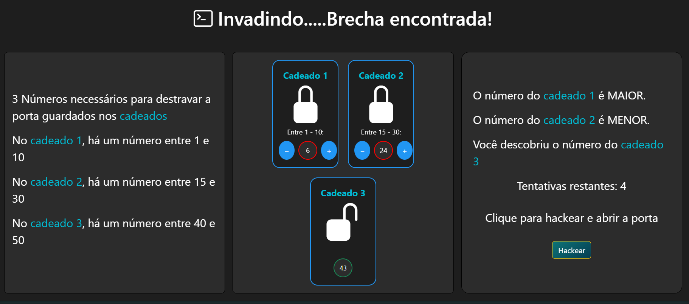

# 🔐 Hack Heist

**Hack Heist** é um minigame em JavaScript onde o jogador assume o papel de um hacker tentando abrir um cofre. Para isso, precisa descobrir os números corretos de cada cadeado usando lógica e tentativa e erro — com limite de tentativas por fase.

---

## 🎮 Demonstração

---

## 🚀 Tecnologias Utilizadas

- HTML5
- CSS3 + Bootstrap 5
- JavaScript Puro
- Bootstrap Icons
- Efeitos sonoros via `<audio>`
- Responsivo para mobile e desktop

---

## 📋 Funcionalidades

- ⚙️ Três fases com dificuldade progressiva
- 🔢 Cadeados com ranges diferentes por fase
- 🔄 Atualização dinâmica dos elementos via DOM
- 🔊 Efeitos sonoros ao acertar cadeados
- 📱 Totalmente responsivo para mobile
- 🎯 Feedback visual com animações

---

## 📱 Responsividade

O jogo é compatível com **dispositivos móveis**, tablets e desktops. O layout se adapta e os botões foram otimizados para toque.

---

## 🧠 Como Jogar

1. Clique em **"Como Jogar"** para abrir o tutorial.
2. Leia os intervalos numéricos de cada cadeado.
3. Use os botões (+ / -) para ajustar os valores.
4. Clique em **"Hackear"** e tente descobrir os números.
5. Você tem 5 tentativas por fase. Boa sorte!

---

## 📁 Como Rodar 

1. Acesse o site hackheist.zanondev.com

Desenvolvido por Antonio Zanon 🚀
Contato: antonio.zanon99@gmail.com
Site principal: zanondev.com

Este projeto está licenciado sob a Licença MIT.